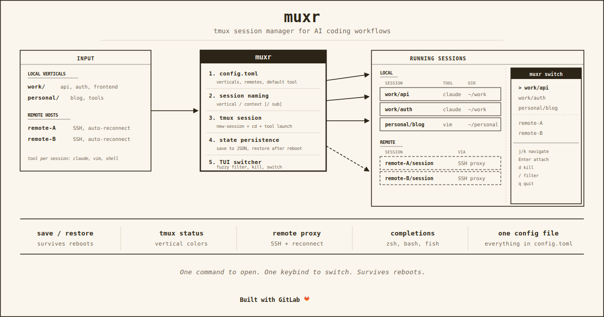

# muxr

[](https://gitlab.com/dunn.dev/muxr)
[](https://gitlab.com/dunn.dev/muxr/-/pipelines)
[](https://crates.io/crates/muxr)
[](LICENSE)

Tmux session manager for AI coding workflows. One command to open a
session, one keybind to switch between them, survives reboots.

## The problem

You work across multiple projects. Each one needs its own terminal
session with the right working directory and the right tool running.
You open tabs, cd around, lose track of what is where. When you
reboot, everything is gone.

muxr organizes tmux sessions into verticals (local directory trees) and
remotes (SSH hosts). Each session knows where it lives and what tool to
run. `muxr save` snapshots everything. `muxr restore` brings it back.

## Install

```bash
cargo install muxr
```

Pre-built binaries for macOS arm64 and Linux amd64 are available in
[releases](https://gitlab.com/dunn.dev/muxr/-/releases).

## Quick start

```bash
muxr init                       # create config
muxr work api                   # open work/api session
muxr personal blog              # open personal/blog session
muxr switch                     # TUI picker to jump between them
muxr save                       # snapshot before reboot
muxr restore                    # bring everything back
```

## Config

One file: `~/.config/muxr/config.toml`

```toml
default_tool = "claude"

[verticals.work]
dir = "~/projects/work"
color = "#7aa2f7"

[verticals.personal]
dir = "~/projects/personal"
color = "#9ece6a"

[remotes.lab]
host = "remote-a.example.com"
user = "deploy"
color = "#d29922"
connect = "ssh"
```

Verticals are local directory trees. Remotes are SSH hosts. Each gets a
color that shows up in the TUI switcher and the tmux status bar.

## How sessions work

muxr is a thin layer over tmux. Each session gets a named tmux session,
the right working directory, and your default tool running.

```
muxr work api
  tmux new-session -s "work/api" -c ~/projects/work
  tmux send-keys "claude" Enter
  tmux attach -t "work/api"
```

Session names follow the pattern `vertical/context`. You can nest
further: `muxr work api auth` creates `work/api/auth`. Sessions persist
across terminal restarts because tmux keeps them alive.

## TUI switcher

`muxr switch` opens an interactive picker. Sessions are color-coded by
vertical, sorted by most recent activity. Local and remote sessions
appear together.

| Key | Action |
|-----|--------|
| `j` / `k` | Navigate |
| `Enter` | Attach to session |
| `d` | Kill session (with confirmation) |
| `/` | Fuzzy filter |
| `q` | Quit |

Bind it in tmux for instant access:

```tmux
bind s display-popup -E -w '80%' -h '80%' "muxr switch"
```

## Remote sessions

Remote sessions create a local tmux proxy that SSHes to the host and
attaches to the remote tmux. They appear in `muxr ls` and the switcher
alongside local sessions.

```bash
muxr lab trustchain             # SSH to remote, attach tmux
muxr lab ls                     # list remote sessions
```

Connections auto-reconnect on SSH drops with exponential backoff.

## Save and restore

```bash
muxr save                       # snapshot all sessions to JSON
muxr restore                    # recreate after reboot
```

Restore recreates local sessions with the correct directory and tool.
Remote sessions re-establish SSH connections.

## Commands

| Command | What it does |
|---------|-------------|
| `muxr` | Control plane (bare shell) |
| `muxr <vertical> [context...]` | Create or attach to a local session |
| `muxr <remote> [context...]` | Create or attach to a remote session |
| `muxr new <vertical> [context...]` | Create session in background |
| `muxr switch` | Interactive TUI session picker |
| `muxr ls` | List active sessions |
| `muxr save` | Snapshot session state |
| `muxr restore` | Recreate sessions after reboot |
| `muxr kill <name>` | Kill a session |
| `muxr kill all` | Kill all sessions |
| `muxr rename <name>` | Rename current session |
| `muxr init` | Create default config |
| `muxr completions <shell>` | Shell completions (zsh, bash, fish) |
| `muxr tmux-status` | tmux status bar integration |

## License

MIT

---

Built in the Den by Tanuki and Andrew Dunn, 2026.
